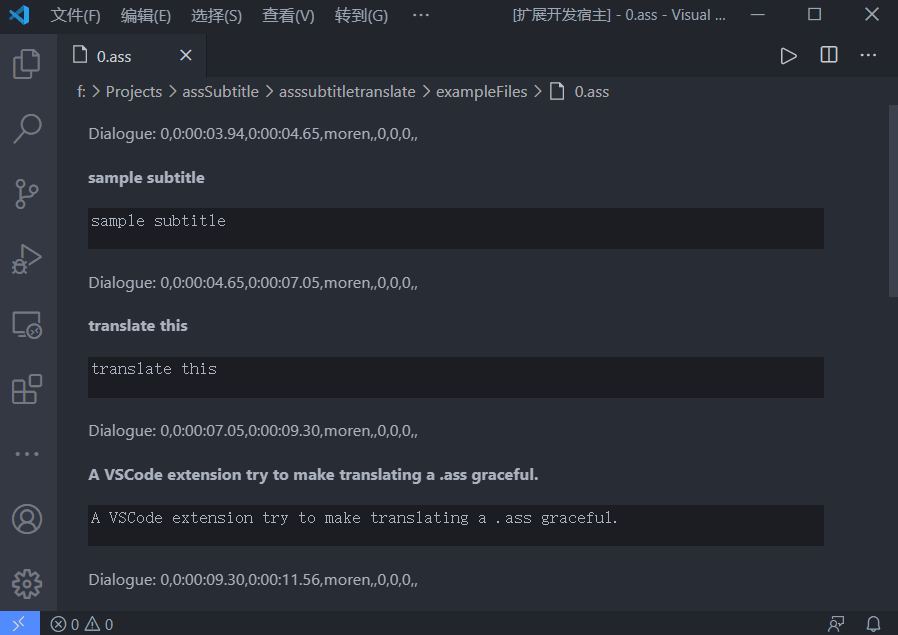

# asssubtitletranslate README

A VSCode extension try to make translating a `.ass` graceful.

## Features
- Parse a `.ass` into a Custom Text Editor
- Auto jump to next line when input `Enter(\n)`

## Release Notes

Still in develop.
### Progress
| |task
|-|-
✔️|parse filecheck
✔️|jump when `enter`
⬜|sync with text document